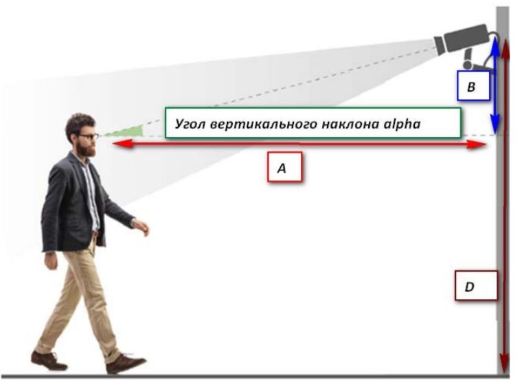

# УГОЛ ВЕРТИКАЛЬНОГО НАКЛОНА КАМЕРЫ

Приложение (WebAPI на ASP.NET Core) позволяет рассчитывать вертикальный угол наклона камеры и сохраняет результат расчёта в базу данных. 

Для расчета вертикального угла наклона камеры и катета используется класс CameraParams и модульный тест CameraParamsTest к нему, который проверяет корректность работы алгоритма. 

Для выполнения запроса к приложению добавлен Swagger UI.

Метод API принимает на вход два параметра: расстояние от камеры до объекта А и высоту установки камеры от пола D в сантиметрах. 

В качестве результата выводятся расстояние B (см) и угол вертикального наклона alpha (градусы). 
Результат расчёта сохраняется в базу данных (EntityFrameworkCore).

Алгоритм расчёта угла вертикального наклона (alpha) определяется из решения параметров при известных катетах A и B и угле 90 градусов между ними (решение прямоугольного треугольника):
https://geleot.ru/education/math/geometry/calc/triangle/right_triangle_catheti

Принимаем средний рост человека равным 160 см, тогда катет B должен всегда рассчитываться по формуле B = D – 160 см.

Другой пример расчета угла можно посмотреть в онлайн-калькуляторе calc.ru
Пример расчета параметров треугольника: https://www.calc.ru/raschet-treugolnika.html

Ввести две стороны A = 700 см (7 метров расстояние до объекта) и B =190 см (катет B определяется так, B = D -160 см = 190 см, камера висит на высоте 350 см - 160 см = 190 см) . Ввести угол между сторонами A и B равным 90 градусов. Получаем угол вертикального наклона 15.19 градусов.
